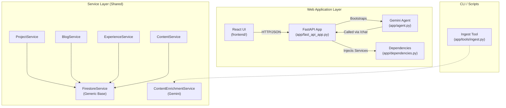
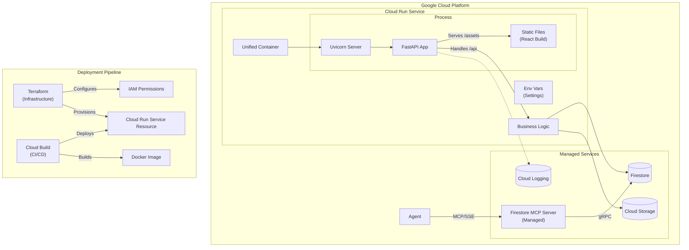

# Architecture and Walkthrough

## Table of Contents
- [Design Decisions](#design-decisions)
- [Application Design](#application-design)
    - [Configuration Management](#configuration-management)
- [Presentation Layer (React + FastAPI)](#presentation-layer-react--fastapi)
    - [CORS Strategy](#cors-strategy)
    - [Rate Limiting](#rate-limiting)
    - [Search Engine Optimisation (SEO)](#search-engine-optimisation-seo)
- [Service Layer](#service-layer)
- [Firestore Data Model](#firestore-data-model)
- [Solution Architecture](#solution-architecture)
    - [Component Architecture](#component-architecture)
    - [Runtime & Deployment Architecture](#runtime--deployment-architecture)
- [Resource Ingestion Architecture](#resource-ingestion-architecture)

This document serves as the technical reference for the **Dazbo Portfolio** application. It outlines the key architectural decisions, the solution design, and the operational workflows for managing content. It is intended for developers and maintainers seeking to understand the system's inner workings, from the React-FastAPI runtime to the data ingestion pipelines.

## Design Decisions

| Decision | Rationale |
|----------|-----------|
| **Use Gemini for LLM** | Native multimodal capabilities and massive 1M+ token context window. |
| **Use ADK for agent framework** | Provides a production-grade foundation for agent orchestration. Provides the ability to orchestrate across multiple agents, manage context and artifacts, provides agentic evaluation tools, and provides convenient developer tools for interacting with agents. |
| **Use FastAPI for backend** | Chosen for its high-performance async capabilities, automatic OpenAPI documentation, and native Pydantic integration, ensuring strict type validation across the API surface. |
| **Use React for frontend** | The industry standard for dynamic UIs. Its declarative component model efficiently handles complex states (like real-time chat and dynamic content filters) and benefits from a massive ecosystem. |
| **Use Vite for frontend build** | Offers instant Hot Module Replacement and optimised production builds using Javascript ES modules, significantly outperforming legacy Webpack-based tools in developer experience and build speed. Efficient delivery to the client. |
| **Use Terraform for infrastructure** | Enables declarative Infrastructure as Code (IaC), allowing us to version, audit, and reproduce the entire GCP environment (Cloud Run, Firestore, IAM) consistently across environments. |
| **Use Google Cloud Build for CI/CD** | A fully managed, serverless CI/CD platform that integrates natively with GCP security. It executes builds in ephemeral, secure environments close to our artifact registry. Integrates seamlessly with GitHub, so that changes pushed to GitHub result in new builds and deployments. |
| **Unified Container Image** | Packaging the frontend, backend, and agent into a single container ensures atomic deployments, and greatly simplifies the overall solution and deployment process. |
| **Unified Origin Architecture** | Serving React static assets directly from the FastAPI backend (acting as the origin) completely eliminates CORS complexity in production and simplifies cookie handling. |
| **Use Firestore for Database** | A serverless, NoSQL document database chosen for its flexibility with semi-structured data (blogs, projects) and seamless integration with the ADK for chat memory/history. |
| **Use Cloud Storage (GCS)** | Scalable object storage used for hosting static assets (images, badges) and archiving logs. It provides a secure, low-latency origin for serving media content globally. |
| **`/api` Prefix** | Establishes a strict routing namespace: `/api` for backend services; all other routes fallback to the SPA (`index.html`). |
| **Deploy to Cloud Run** | A fully managed serverless platform that scales to zero (cost-effective) and handles autoscaling automatically. It abstracts infrastructure management while running standard OCI containers. It also supports custom domains without the need for a Load Balancer. |
| **Use `uv` for Package Management** | Replaces `pip`/`poetry` with a single, ultra-fast (Rust-based) tool for dependency resolution and environment management, ensuring deterministic builds. |
| **Use `InMemorySessionService`** | Sessions are designed to be ephemeral (per browser tab). An in-memory store offers the lowest possible latency and simplest implementation without needing external persistence like Redis. |
| **Use In-Memory Rate Limiting** | Implemented via `slowapi` to provide essential DoS protection and cost control for the LLM. At our current scale, this avoids the operational overhead of a dedicated Redis cluster. |
| **Hybrid Ingestion for Medium** | Combines RSS feed and Zip Archive (history) to overcome the issue that Medium's RSS feed only returns the last 10 blogs. |
| **Platform-Scoped IDs** | Document IDs are prefixed with the platform name (e.g., `medium:slug`) to allow cross-platform articles with identical titles to coexist. |
| **Normalisation** | All URLs are normalised (stripping query params and trailing slashes) to ensure consistent matching and prevent duplicates. |
| **AI-Powered Summary Creation** | Uses Gemini to generate concise technical summaries from ingested blogs. |
| **AI-Powered Markdown Creation** | Uses Gemini to generate structured Markdown from raw blog HTML (Archive) or RSS. |
| **Use Cloud Run Domain Mapping** | Maps custom domain directly to the Cloud Run service, removing the need for a Load Balancer. |
| **Use React 19 Native Metadata** | Leverages built-in hoisting for `<title>` and `<meta>` tags, eliminating the need for external libraries like `react-helmet`. |
| **Disable Session Affinity** | Removed to encourage stateless design and ensure even load balancing when scaling beyond one instance in the future. |
| **Enable CPU Idle (Throttling)** | `cpu_idle = true` reduces costs by throttling CPU between requests. Verified safe for async Gemini streaming as the request remains active during the stream. |
| **Enable Startup CPU Boost** | Provides additional CPU during instance startup to mitigate cold start latency for the Python application. |
| **FastAPI SEO Injection** | Dynamically injects SEO tags into `index.html` on the first request, ensuring optimal crawling and social previews for the SPA. |
| **Server-Side Path Validation** | Robust path traversal protection using high-probability absolute path resolution within `serve_spa`. |
| **Hybrid Agent Tooling** | Combines managed Firestore MCP for surgical retrieval with bespoke Python tools for discovery and counting. Includes a monkey-patch for the `mcp-python-sdk` to bypass server-side JSON `null` schema bugs. |

## Application Design

The application follows a clean, layered architecture to ensure separation of concerns and testability.

### Configuration Management

The application uses `pydantic-settings` to manage configuration in a centralised and type-safe manner.

*   **Settings Model**: Defined in `app/config.py`, the `Settings` class declares all configurable parameters (e.g., Project ID, Model Name, API Keys).
*   **Loading Strategy**:
    1.  **Environment Variables**: In production environments (like Cloud Run), settings are injected as environment variables. This is the primary method for configuration.
    2.  **`.env` File**: For local development, settings are loaded from a `.env` file in the project root. This file is excluded from version control.
*   **Usage**: The `settings` object is imported and used throughout the application (e.g., in `app/agent.py`), ensuring that hardcoded values are avoided.

## Presentation Layer (React + FastAPI)

The application employs a **Unified Origin Architecture**. In production, the FastAPI backend serves both the REST API and the compiled React frontend assets.

*   **Frontend (React/Vite)**:
    *   **Framework**: React 19+ with TypeScript, built using Vite.
    *   **API Calls**: All frontend data fetching is directed to the `/api` prefix (e.g., `/api/blogs`).

*   **Backend (FastAPI)**:
    *   **Entry Point**: `app/fast_api_app.py` initialises the application, configures middleware (CORS, Telemetry), and defines the lifespan context.
    *   **API Prefixing**: All routes are explicitly prefixed with `/api`.
    *   **Static Serving**: Mounts the `frontend/dist` directory to serve static assets (`/assets/*`).
    *   **SPA Support**: Implements a catch-all route that serves `index.html` for any non-API, non-asset path, enabling React Router's client-side navigation.
    *   **Dependency Injection**: `app/dependencies.py` provides dependency injection providers to supply Services to Route Handlers.
    *   **Routes**: API endpoints expose the functionality (e.g., `/projects`, `/blogs`, `/experience`) and Agent interaction.

## CORS Strategy

*   **Production**: Since the frontend and API share the same origin (protocol, host, and port), the browser's Same-Origin Policy is satisfied without any explicit CORS configuration.
*   **Local Development**: To maintain a rapid developer loop, the React development server (`:5173`) and FastAPI backend (`:8000`) run as separate processes. Vite is configured to **proxy** requests from `/api` to the backend, mirroring the production environment's single-origin behavior. This avoids the need to enable permissive CORS headers on the backend.

## Rate Limiting

The application implements a multi-tier rate limiting strategy using `slowapi` (a Python port of `Flask-Limiter`) to protect against abuse and manage operational costs.

### Backend Strategy

*   **Global Limit**: A baseline limit of 60 requests per minute is applied to all endpoints under the `/api` prefix.
*   **Strict Agent Limit**: The chat endpoint (`/api/chat/stream`) is restricted to 5 requests per minute per client IP to control LLM token usage and costs.
*   **Exemptions**: Health checks (`/api/health`) and static assets served by the backend are exempt from rate limiting.
*   **Storage**: Limits are tracked in-memory within the FastAPI process. Note that in a multi-instance Cloud Run deployment, limits are enforced per-instance.

### Frontend Integration

*   **Global Handling**: A central Axios interceptor (`frontend/src/services/api.ts`) monitors all API responses. Any 429 error triggers a console warning to notify developers and users of rate limit exhaustion.

## Search Engine Optimisation (SEO)

The application implements a hybrid SEO strategy that combines server-side tag injection for crawlers with client-side updates for real-world user navigation.

### Hybrid SEO Architecture

Since the frontend is a Single Page Application (SPA), search engines and social media bots often see only an empty `index.html` before the Javascript executes. To solve this, we use a hybrid approach:

1.  **Backend Tag Injection**: When the FastAPI backend serves the initial `index.html` (via `serve_spa`), it fetches the relevant SEO metadata (title, description, OG tags, JSON-LD) from a server-side `seo_map`.
2.  **Placeholder Replacement**: The backend replaces a `<!-- __SEO_TAGS__ -->` placeholder in the HTML stream with the actual tags.
3.  **Client-Side Parity**: A custom `useSeo` hook (`frontend/src/hooks/useSeo.ts`) fetches the same metadata from `/api/seo` during client-side navigation (e.g., clicking a link) to update the browser's document title and meta tags manually.

### Static XML Sitemap & Robots.txt
*   **Sitemap**: Provided at `/sitemap.xml`, dynamically generated pointing to search-friendly routes.
*   **Robots.txt**: Located in `frontend/public/`, directing crawlers to the sitemap.

## Security

The application follows a "defense-in-depth" approach to security, particularly concerning file serving and origin protection.

### Path Traversal Protection

Serving a SPA catch-all route carries the risk of "Path Traversal" attacks (e.g., `/../../etc/passwd`). We mitigated this in the `serve_spa` endpoint with robust validation:
1.  **Absolute Path Resolution**: We resolve the requested path relative to the `frontend/dist` directory using `os.path.abspath`.
2.  **Restricted Root**: We verify that the resolved absolute path actually resides *within* the intended directory.
3.  **Explicit Fallbacks**: Invalid or out-of-bounds requests are rejected with a 404, while valid non-file requests default to serving `index.html`.

### XSS Protection in SEO Injection

Dynamic SEO injection involves inserting user-supplied paths into HTML tags (like `<title>` and `<link>`). We protect against reflected Cross-Site Scripting (XSS) by:
- **HTML Escaping**: All variables injected into the HTML stream (e.g., `full_title`, `description`, `url`) are strictly escaped using `html.escape()`.
- **JSON-LD Safety**: Structured data is serialised using `json.dumps()`, ensuring safe injection into the `<script>` block.

## Service Layer

*   **Generic Data Access**: `app/services/firestore_base.py` defines a generic `FirestoreService[T]` class. It handles common CRUD operations (create, get, list, update, delete) for any Pydantic model.
*   **Domain Services**: Specialized services (`ProjectService`, `BlogService`, `ExperienceService`, `ContentService`) inherit from the generic base or use it to implement domain-specific logic.
*   **Session Management**: Uses `InMemorySessionService` from the Google ADK. Sessions are ephemeral and tied to the current application process, which is sufficient for the portfolio's conversational needs.

### Data/Model Layer

*   **Pydantic Models**: Located in `app/models/`, these define the schema for data entities (`Project`, `Blog`, `Experience`) and ensure type safety and validation between the API and Firestore.

## Firestore Data Model

The application uses **Google Firestore** in Native mode. Data is organized into top-level collections corresponding to the domain entities.

### Collections

*   **`projects`**: Stores portfolio projects (e.g., GitHub repos, manual entries).
*   **`applications`**: Stores curated applications (e.g., standalone websites, live demos) ingested via YAML.
*   **`blogs`**: Stores blog posts (e.g., Medium articles, Dev.to posts).
*   **`experience`**: Stores work experience entries.
*   **`content`**: Stores singleton content pages (e.g., `about`) with Markdown bodies.

### Document IDs

To ensure readable and deterministic URLs/pointers, the system uses **Platform-Scoped Slug IDs** for documents in the `projects`, `applications`, and `blogs` collections.

*   **Format**: `<platform>:<slug>` (e.g., `medium:my-article`, `github:my-repo`).
*   **Generation**: IDs are generated by "slugifying" the entity's title (lowercase, alphanumeric, hyphens) and prepending the source platform.
*   **Benefits**:
    -   **Readability**: Easier to identify documents in the Cloud Console.
    -   **Determinism**: Re-ingesting the same resource maps to the same document.
    -   **Cross-Platform Coexistence**: Allows the same article title to exist on both Medium and Dev.to as unique Firestore entities.

### Data Migration & Deduplication

Before each ingestion run, the tool performs an automatic **Migration & Deduplication Pass**:
1.  **Normalisation**: It scans existing items and renames those using the old ID format (no prefix) to the new platform-scoped format.
2.  **Merging**: It identifies items with the same normalised URL. If duplicates exist, it merges them into a single "best" record (prioritising those with AI summaries and Markdown content) and deletes the redundant entries.
3.  **URL Normalisation Logic**: Strips query parameters (e.g., `?source=rss`) and trailing slashes to ensure `https://site.com/p/123/` and `https://site.com/p/123?ref=xyz` match correctly.

### Blog Model Fields

The `blogs` collection uses the following schema:

| Field | Type | Description | Source |
| :--- | :--- | :--- | :--- |
| `title` | String | The title of the blog post. | RSS / Medium Export (HTML Title) |
| `date` | String | Publication date in ISO 8601 format (YYYY-MM-DD). | RSS / Medium Export (`time` tag) |
| `url` | String | Canonical URL to the original post. | RSS / Medium Export (Footer link) |
| `platform` | String | The publishing platform (e.g., "Medium", "Dev.to"). | Connector specific |
| `summary` | String | A short description or subtitle. Used for list views. | RSS Description / Medium Subtitle. Fallback to `ai_summary`. |
| `ai_summary` | String | A comprehensive technical summary generated by Gemini. | **Generated** by `ContentEnrichmentService` from full text. |
| `markdown_content` | String | The full blog content converted to Markdown. Includes frontmatter. | **Converted** from HTML export using `markdownify`. |
| `tags` | Array<String> | List of technical tags. | Medium Tags (`ul.p-tags`) or **Generated** by `ContentEnrichmentService`. |
| `is_private` | Boolean | Flag for paywalled/member-only content. | Heuristic check ("Member-only story") in content. |
| `is_manual` | Boolean | True if added via YAML, False if ingested via API/Zip. | Ingestion logic |
| `source_platform` | String | Specific connector source (e.g., `medium_rss`, `medium_archive`). | Ingestion logic |

### Content Model Fields

The `content` collection (used for singleton pages like `about`) uses the following schema:

| Field | Type | Description | Source |
| :--- | :--- | :--- | :--- |
| `title` | String | The title of the page (e.g., "About Me"). | Manual Firestore entry |
| `body` | String | The full page content in Markdown format. | Manual Firestore entry |
| `last_updated` | Timestamp | The date and time of the last update. | Manual Firestore entry |

## Solution Architecture

### Component Architecture

The following diagram illustrates the relationship between the application's runtime components, the ingestion scripts, and the shared code modules.



### Runtime & Deployment Architecture



### Module & Service Relationships

The architecture is designed to maximize code reuse between the runtime API and the offline ingestion tools.

1.  **Shared Service Layer**: Both the FastAPI application (`app/fast_api_app.py`) and the Ingestion CLI (`app/tools/ingest.py`) rely on the same Service Layer (`app/services/`). This ensures that business logic, such as data validation or Firestore interactions, remains consistent regardless of whether data is being accessed by a user or written by a script.
2.  **Dependency Injection**: The FastAPI app uses `app/dependencies.py` to inject these services into route handlers. This decouples the routes from the concrete service implementation, facilitating testing and loose coupling.
3.  **Generic Data Access**: The `FirestoreService` (`app/services/firestore_base.py`) provides a generic implementation of CRUD operations using Python 3.12+ type parameters. Domain-specific services (`ProjectService`, etc.) inherit from this base, reducing boilerplate code.
4.  **Agent Integration**: The Gemini Agent (`app/agent.py`) is integrated directly into the FastAPI application. It shares the same runtime environment and can potentially access the same services (via tools) to answer user queries about the portfolio content.

## Resource Ingestion Architecture

The portfolio populates its content (Projects and Blogs) through a hybrid ingestion system, designed to be run "out-of-band" via a CLI tool.

### The Ingestion CLI (`app/tools/ingest.py`)

This tool allows the developer to trigger synchronisation from external sources or ingest manually defined resources from a YAML file.

**Usage:**
```bash
uv run python -m app.tools.ingest \
  --github-user <user-name> \
  --medium-user <user-name> \
  --medium-zip <path-to-posts.zip> \
  --devto-user <user-name> \
  --about-file <path-to-about.md> \
  --yaml-file manual_resources.yaml
```

### Code Sharing & Dependencies

The ingestion tool is **not** a standalone script. It is an integral part of the application codebase and relies heavily on the same components used by the containerised FastAPI backend.

**Shared Code:**
*   **Models (`app.models`):** Uses the exact same Pydantic models (e.g., `Blog`, `Project`, `Content`) to ensure data consistency.
*   **Services (`app.services`):** Reuses core business logic, including `FirestoreService` and `ContentService` for database operations and `ContentEnrichmentService` for AI processing.
*   **URL Normalisation**: Standardises all URLs (stripping query params and trailing slashes) to ensure consistent matching across platforms.

### Migration & Deduplication

Before processing new data, the tool performs a safety pass:
1.  **ID Normalisation**: Existing documents using old ID formats are renamed to the new platform-scoped format (`prefix:slug`).
2.  **Duplicate Merging**: Documents sharing the same normalised URL are merged, keeping the record with the most complete metadata.

### Connectors

The system uses modular "Connectors" to fetch data:
*   **GitHub Connector:** Uses the GitHub API to fetch public repositories.
*   **Medium Connector (RSS):** Parses the user's Medium RSS feed for the latest 10 posts. Now includes full Markdown content extraction and AI enrichment for new posts.
*   **Medium Archive Connector (Zip):** Parses a Medium export archive (`posts.zip`). Retrieves the full history of posts.
*   **Dev.to Connector:** Uses the Dev.to API to fetch published articles. Includes **"Quickie" Filtering** (skipping articles with < 200 words) to ignore comments or boosts.
*   **About Page Ingest:** Directly updates the singleton `about` document in Firestore.
*   **Manual YAML:** Parses a local YAML file for "Metadata Only" entries.

### Content Processing & AI Enrichment

The ingestion pipeline performs the following steps:

1.  **Standardisation**: Applies URL normalisation and the migration pass.
2.  **Draft Filtering:** Files with "draft" in the name or title are automatically skipped.
3.  **HTML to Markdown Conversion:** Raw HTML is converted to structured Markdown using `markdownify`.
4.  **AI Enrichment (ContentEnrichmentService):** Sends text to Gemini to generate technical **summaries** and **tags**.
5.  **Persistence**: Saves to Firestore using platform-scoped IDs. Documents already containing an `ai_summary` are skipped unless explicit patching is required.

### Static Assets (Images)

*   **Storage:** Images (project screenshots, thumbnails) are stored in a public **Google Cloud Storage (GCS)** bucket (e.g., `<project-id>-assets`).
*   **Ingestion:** Currently, images must be uploaded manually to the GCS bucket (e.g., via `gsutil` or Cloud Console).
*   **Linking**:
    *   **New Manual Entries:** Add the public URL to the `image_url` field in your `manual_resources.yaml` file.
    *   **Existing Entries (e.g., from GitHub/Medium):**
        1.  Upload the image to the GCS bucket.
        2.  Copy the public URL (e.g., `https://storage.googleapis.com/<bucket>/<image.png>`).
        3.  Go to the **Google Cloud Console > Firestore**.
        4.  Find the document for the project or blog post.
        5.  Manually add or update the `image_url` field with the copied URL.
*   **Future:** Automated image scraping and uploading may be added in future phases.

### Data Management

*   **Deletions:** The ingestion tool currently supports **create** and **update** operations. It does *not* delete entries that have been removed from the source.
    *   **To Delete:** Use the **Google Cloud Console (Firestore)** to manually delete obsolete documents. This is a safety design choice to prevent accidental bulk deletion.

### Manual Resources YAML Schema

To ingest resources that are not on GitHub, Medium, or Dev.to (e.g., standalone websites, private projects, or specific external articles), use a YAML file with the following structure:

**Example `manual_resources.yaml`:**

```yaml
projects:
  - title: "Some External Project"
    description: "A project not on GitHub."
    repo_url: "https://some-link.com"
    tags: ["python", "cli"]
    featured: true
    metadata_only: true 

applications:
  - title: "Advent of Code Walkthroughs"
    description: "A comprehensive site featuring Python walkthroughs and learning resources for Advent of Code challenges."
    demo_url: "https://aoc.just2good.co.uk/"
    image_url: "https://storage.googleapis.com/<project-id>-assets/aoc-walkthroughs.png"
    tags: ["python", "algorithms", "education"]

videos:
  - title: "YouTube Tutorial"
    description: "A technical presentation about agentic AI."
    video_url: "https://www.youtube.com/watch?v=dQw4w9WgXcQ"
    thumbnail_url: "https://storage.googleapis.com/<project-id>-assets/video-thumb.png"
    publish_date: "2024-03-24"

blogs:
  - title: "Understanding Python Decorators"
    summary: "A deep dive into how decorators work under the hood."
    date: "2025-12-01"
    platform: "External"
    url: "https://realpython.com/some-guest-post"
    metadata_only: true
```

**Fields:**

*   **Projects:** `title` (required), `description`, `repo_url`, `demo_url`, `image_url`, `tags` (list), `featured` (bool), `metadata_only` (bool).
*   **Applications:** `title` (required), `description` (required), `demo_url` (required), `repo_url` (optional), `image_url`, `tags` (list). These are automatically marked as `featured: true` and `source_platform: "application"`.
*   **Videos:** `title` (required), `description` (required), `video_url` (required), `thumbnail_url` (optional), `publish_date` (ISO 8601).
*   **Blogs:** `title` (required), `summary`, `date` (ISO 8601), `platform` (e.g., "External", "Substack"), `url` (required), `metadata_only` (bool).

## Agent Integration Architecture

The application features an interactive AI assistant powered by the **Google Agent Development Kit (ADK)** and the **Gemini 3** model.

### Hybrid Tooling Rationale

The agent employs a **Hybrid Tooling Architecture**, combining managed Google services with application-specific Python logic. This design was chosen for several critical architectural reasons:

1.  **Context Efficiency (The "Discovery" Problem)**:
    -   The managed Firestore MCP `list_documents` tool returns the **full content** of every document in a collection.
    -   For broad searches (e.g., "Do you have any Python blogs?"), this would dump tens of thousands of tokens into the LLM's context window, leading to high costs and potential context limit exhaustion.
    -   The bespoke `search_portfolio` tool is optimised for discovery, returning only concise summaries and unique IDs.

2.  **Schema Robustness (The "Null" Workaround)**:
    -   The managed Firestore MCP server currently has a schema bug where optional fields are returned as literal JSON `null` instead of the expected `"NULL_VALUE"` enum string.
    -   While a monkey-patch was implemented to bypass client-side validation, relying solely on MCP for discovery remains risky. The hybrid approach provides a reliable fallback.

3.  **Accuracy and Performance (Counting)**:
    -   Accurate document counting (e.g., "How many blogs are there?") is instantaneous and deterministic in Python.
    -   Expecting an LLM to count raw JSON results from a generic list tool is slow, expensive, and prone to "off-by-one" hallucinations.

4.  **Surgical Retrieval (ROI on Precision)**:
    -   For fetching the full Markdown body of a *specific* item (via `get_document`), the managed MCP server is superior.
    -   It eliminates the need to maintain bespoke retrieval logic and ensures the agent always uses the official Google-managed protocol for detailed data access.

### Search Ranking Logic

To ensure the agent prioritises the most relevant or high-quality content, the `search_portfolio` tool implements the following tier-based ranking logic:

1.  **Direct ID Matches**: Exact matches on document IDs (e.g., a specific project slug) are always returned first.
2.  **Recent Starred Projects**: For GitHub projects, items updated within the last 45 days that have at least one star are prioritised. This ensures visitors see active work first.
3.  **Star Count Fallback**: Older projects are sorted primarily by their star count.
4.  **Blog Recency**: Blogs are ranked by publication date, ensuring the latest technical insights are prominent.
5.  **Deduplication**: The tool automatically filters out duplicate URLs across platforms, favouring the record with the most complete AI-generated summary and Markdown content.

### Workflow Handover

When a user asks a general question (e.g., "What Python blogs do you have?"), the agent uses `search_portfolio` to find relevant matches and their unique IDs. If the user then requests details on a specific item, the agent hands over the ID to the MCP `get_document` tool to fetch the full Markdown body directly from Firestore.

