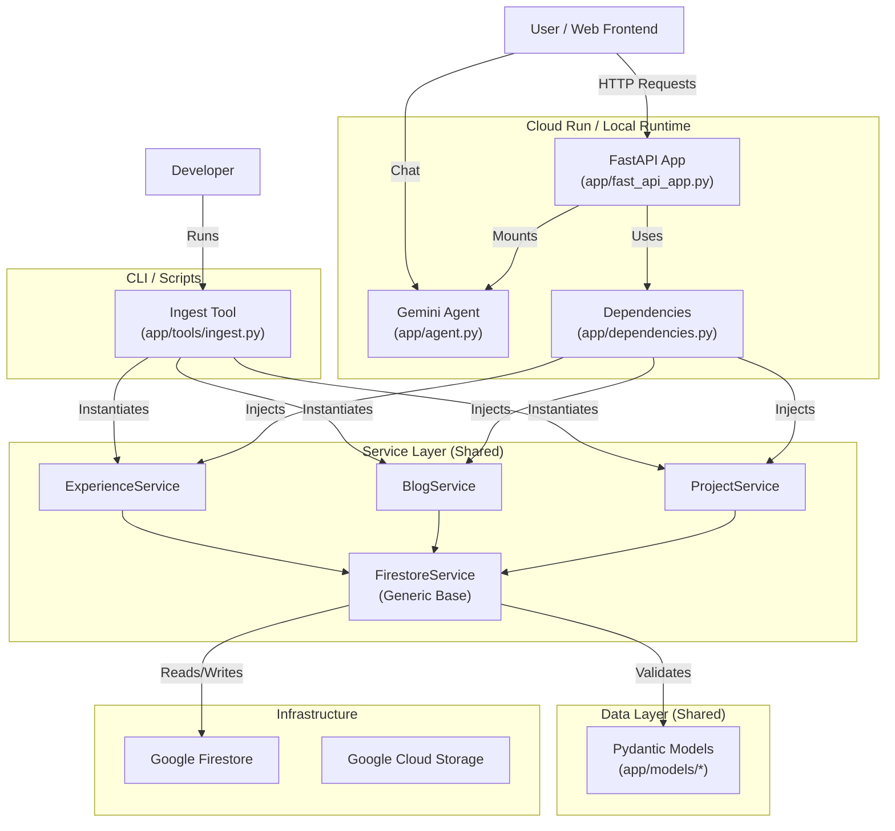

# Design and Walkthrough

This document serves as the technical reference for the **Dazbo Portfolio** application. It outlines the key architectural decisions, the solution design, and the operational workflows for managing content. It is intended for developers and maintainers seeking to understand the system's inner workings, from the React-FastAPI runtime to the data ingestion pipelines.

## Design decisions:

| Decision | Rationale |
|----------|-----------|
| Use ADK for agent framework | ADK provides a solid foundation for building agents, including tools for memory, state management, and more. |
| Use Gemini for LLM | Gemini is a powerful LLM that is well-suited for this application. |
| Use FastAPI for backend | FastAPI is a modern, fast, and easy-to-use web framework for building APIs. |
| Use React for frontend | React is a popular and powerful library for building user interfaces. |
| Use Terraform for infrastructure | Terraform is a tool for defining and provisioning infrastructure as code. |
| Use Google Cloud Build for CI/CD | Google Cloud Build is a managed CI/CD service that is well-suited for this application. |
| The frontend, API and backend agent will be containerised into a single container image. | This is to simplify deployment and management. |
| The container will be deployed to Cloud Run. | Cloud Run is a fully-managed, serverless compute platform that lets you run containers directly on Google Cloud infrastructure. |
| Use InMemorySessionService for session management | There is no need for session persistence across restarts for this application. |
| Use Python 3.12+ Type Parameters | Leverages modern Python generic syntax (PEP 695) for cleaner and more expressive code, particularly in the Service layer. |

## Application Design

The application follows a clean, layered architecture to ensure separation of concerns and testability.

### 1. Presentation Layer (FastAPI)

*   **Entry Point**: `app/fast_api_app.py` initializes the application, configures middleware (CORS, Telemetry), and defines the lifespan context.
*   **Dependency Injection**: `app/dependencies.py` provides dependency injection providers to supply Services to Route Handlers.
*   **Routes**: API endpoints expose the functionality (e.g., `/projects`, `/blogs`, `/experience`) and Agent interaction.

### 2. Service Layer

*   **Generic Data Access**: `app/services/firestore_base.py` defines a generic `FirestoreService[T]` class. It handles common CRUD operations (create, get, list, update, delete) for any Pydantic model.
*   **Domain Services**: Specialized services (`ProjectService`, `BlogService`, `ExperienceService`) inherit from the generic base or use it to implement domain-specific logic.
*   **Session Management**: Uses `InMemorySessionService` from the Google ADK. Sessions are ephemeral and tied to the current application process, which is sufficient for the portfolio's conversational needs.

### 3. Data/Model Layer

*   **Pydantic Models**: Located in `app/models/`, these define the schema for data entities (`Project`, `Blog`, `Experience`) and ensure type safety and validation between the API and Firestore.

## Firestore Data Model

The application uses **Google Firestore** in Native mode. Data is organized into top-level collections corresponding to the domain entities.

### Collections

*   **`projects`**: Stores portfolio projects (e.g., GitHub repos, manual entries).
*   **`blogs`**: Stores blog posts (e.g., Medium articles, Dev.to posts).
*   **`experience`**: Stores work experience entries.

### Document IDs

To ensure readable and deterministic URLs/pointers, the system uses **Slug-based IDs** for documents in the `projects` and `blogs` collections.

*   **Generation**: IDs are generated by "slugifying" the entity's title (lowercase, alphanumeric, hyphens).
    *   Example: Title "My Awesome Project" -> ID `my-awesome-project`
*   **Benefits**:
    *   **Readability**: Easier to identify documents in the Cloud Console.
    *   **Determinism**: Re-ingesting the same resource (with the same title) maps to the same document, preventing duplicates.


## Solution Architecture

The following diagram illustrates the relationship between the application's runtime components, the ingestion scripts, and the shared code modules.



### Module & Service Relationships

The architecture is designed to maximize code reuse between the runtime API and the offline ingestion tools.

1.  **Shared Service Layer**: Both the FastAPI application (`app/fast_api_app.py`) and the Ingestion CLI (`app/tools/ingest.py`) rely on the same Service Layer (`app/services/`). This ensures that business logic, such as data validation or Firestore interactions, remains consistent regardless of whether data is being accessed by a user or written by a script.
2.  **Dependency Injection**: The FastAPI app uses `app/dependencies.py` to inject these services into route handlers. This decouples the routes from the concrete service implementation, facilitating testing and loose coupling.
3.  **Generic Data Access**: The `FirestoreService` (`app/services/firestore_base.py`) provides a generic implementation of CRUD operations using Python 3.12+ type parameters. Domain-specific services (`ProjectService`, etc.) inherit from this base, reducing boilerplate code.
4.  **Agent Integration**: The Gemini Agent (`app/agent.py`) is integrated directly into the FastAPI application. It shares the same runtime environment and can potentially access the same services (via tools) to answer user queries about the portfolio content.

## Use Cases

*   **Portfolio Browsing**: Users can retrieve lists of projects, blog posts, and work experience.
*   **Agent Interaction**: Users can chat with the Gemini-powered agent to ask questions about the portfolio owner's skills and background.

## Resource Ingestion Architecture

The portfolio populates its content (Projects and Blogs) through a hybrid ingestion system, designed to be run "out-of-band" via a CLI tool.

### 1. The Ingestion CLI (`app/tools/ingest.py`)

This tool allows the developer to trigger synchronization from external sources or ingest manually defined resources from a YAML file.

**Usage:**
```bash
uv run python -m app.tools.ingest \
  --github-user <user-name> \
  --medium-user <user-name> \
  --devto-user <user-name> \
  --yaml-file manual_resources.yaml
```

### 2. Connectors

The system uses modular "Connectors" to fetch data:
*   **GitHub Connector:** Uses the GitHub API to fetch public repositories. Maps `html_url` to `repo_url`, `topics` to `tags`, and `description` to `description`.
*   **Medium Connector:** Parses the user's Medium RSS feed. Maps posts to `Blog` entries.
*   **Dev.to Connector:** Uses the Dev.to API to fetch published articles. Maps articles to `Blog` entries.
*   **Manual YAML:** Parses a local YAML file for "Metadata Only" entries (e.g., private projects, external links, paywalled articles).

### 3. Data Persistence & Idempotency

*   **Destination:** All data is stored in **Google Firestore**.
*   **Idempotency (Upsert Logic):** The ingestion process is designed to be safe to re-run.
    *   It checks if an entry already exists based on a unique key (typically `repo_url` for projects or `url` for blogs).
    *   If the entry exists, it **updates** the record with the latest metadata from the source.
    *   If it does not exist, it **creates** a new document.
    *   **Note:** This means you can run the ingestion tool repeatedly to sync updates (e.g., star counts, description changes) without creating duplicate entries.

### 4. Static Assets (Images)

*   **Storage:** Images (project screenshots, thumbnails) are stored in a public **Google Cloud Storage (GCS)** bucket (e.g., `<project-id>-assets`).
*   **Ingestion:** Currently, images must be uploaded manually to the GCS bucket (e.g., via `gsutil` or Cloud Console).
*   **Linking:**
    *   **New Manual Entries:** Add the public URL to the `image_url` field in your `manual_resources.yaml` file.
    *   **Existing Entries (e.g., from GitHub/Medium):**
        1.  Upload the image to the GCS bucket.
        2.  Copy the public URL (e.g., `https://storage.googleapis.com/<bucket>/<image.png>`).
        3.  Go to the **Google Cloud Console > Firestore**.
        4.  Find the document for the project or blog post.
        5.  Manually add or update the `image_url` field with the copied URL.
*   **Future:** Automated image scraping and uploading may be added in future phases.

### 5. Data Management

*   **Deletions:** The ingestion tool currently supports **create** and **update** operations. It does *not* delete entries that have been removed from the source.
    *   **To Delete:** Use the **Google Cloud Console (Firestore)** to manually delete obsolete documents. This is a safety design choice to prevent accidental bulk deletion.

### 6. Manual Resources YAML Schema

To ingest resources that are not on GitHub, Medium, or Dev.to (e.g., standalone websites, private projects, or specific external articles), use a YAML file with the following structure:

**Example `manual_resources.yaml`:**

```yaml
projects:
  - title: "Advent of Code Walkthroughs"
    description: "My solutions and Python learning resources for Advent of Code."
    repo_url: "https://github.com/derailed-dash/advent-of-code" # Optional, if there is a repo
    demo_url: "https://aoc.just2good.co.uk/"
    image_url: "https://storage.googleapis.com/<project-id>-assets/aoc-thumb.png"
    tags: ["python", "algorithms", "education"]
    featured: true
    metadata_only: true # Indicates this is purely a reference, not fully managed by connector

blogs:
  - title: "Understanding Python Decorators"
    summary: "A deep dive into how decorators work under the hood."
    date: "2025-12-01"
    platform: "External"
    url: "https://realpython.com/some-guest-post"
    metadata_only: true
```

**Fields:**
*   **Projects:** `title` (required), `description`, `repo_url`, `demo_url`, `image_url`, `tags` (list), `featured` (bool), `metadata_only` (bool).
*   **Blogs:** `title` (required), `summary`, `date` (ISO 8601), `platform` (e.g., "External", "Substack"), `url` (required), `metadata_only` (bool).
