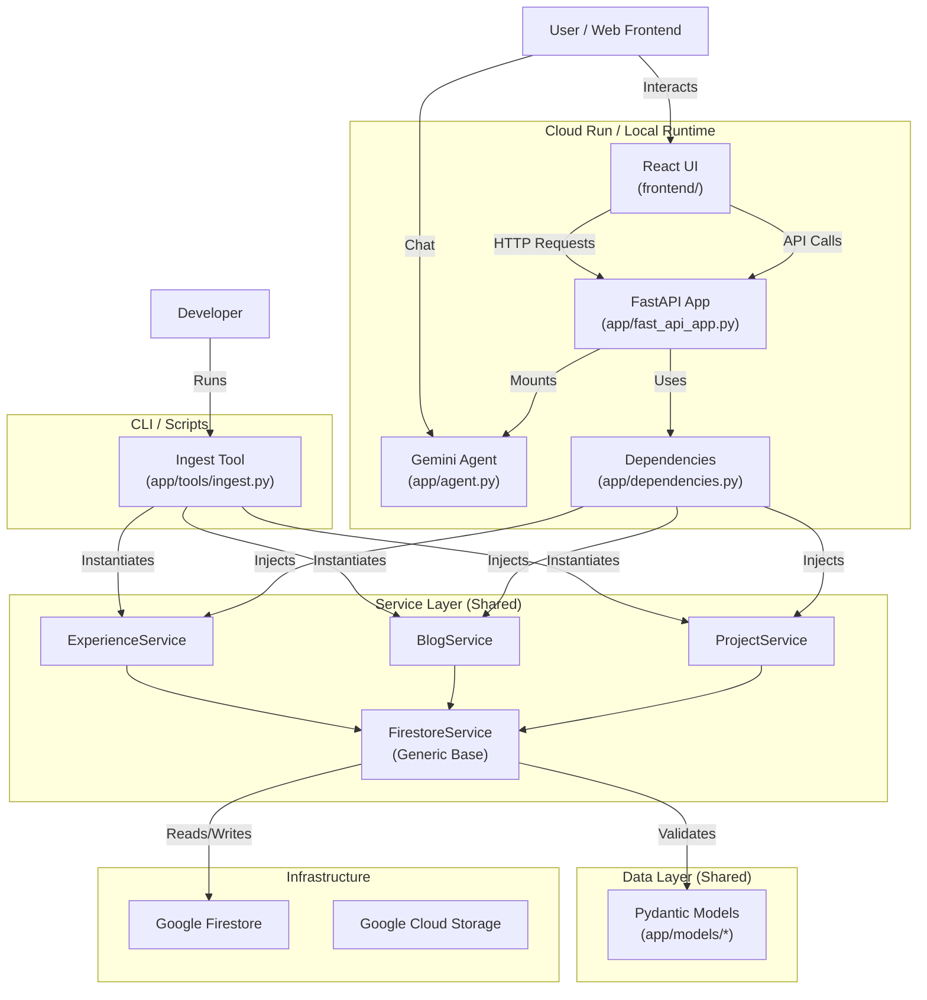
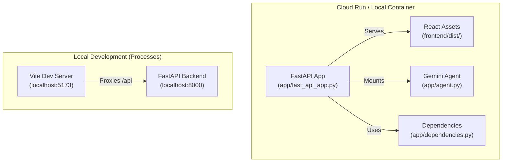

# Design and Walkthrough

This document serves as the technical reference for the **Dazbo Portfolio** application. It outlines the key architectural decisions, the solution design, and the operational workflows for managing content. It is intended for developers and maintainers seeking to understand the system's inner workings, from the React-FastAPI runtime to the data ingestion pipelines.

## Design decisions:

| Decision | Rationale |
|----------|-----------|
| Use ADK for agent framework | ADK provides a solid foundation for building agents, including tools for memory, state management, and more. |
| Use Gemini for LLM | Gemini is a powerful LLM that is well-suited for this application. |
| Use FastAPI for backend | FastAPI is a modern, fast, and easy-to-use web framework for building APIs. |
| Use React for frontend | React is a popular and powerful library for building user interfaces. |
| Use Vite for frontend build | Vite offers superior performance and simplicity for SPAs compared to legacy tools like CRA. |
| Use Terraform for infrastructure | Terraform is a tool for defining and provisioning infrastructure as code. |
| Use Google Cloud Build for CI/CD | Google Cloud Build is a managed CI/CD service that is well-suited for this application. |
| The frontend, API and backend agent will be containerised into a single container image. | This is to simplify deployment and management. |
| Use a Unified Origin architecture. | Serving the React SPA directly from FastAPI simplifies origin management and eliminates CORS complexity in production. |
| Use an `/api` prefix for all backend routes. | Provides a clear namespace for backend services and prevents collisions with frontend client-side routes. |
| The container will be deployed to Cloud Run. | Cloud Run is a fully-managed, serverless compute platform that lets you run containers directly on Google Cloud infrastructure. |
| Use InMemorySessionService for session management | There is no need for session persistence across restarts for this application. |
| Use Python 3.12+ Type Parameters | Leverages modern Python generic syntax (PEP 695) for cleaner and more expressive code, particularly in the Service layer. |
| Use In-Memory Rate Limiting | Implemented via `slowapi` to control LLM costs and provide basic DoS protection without additional infrastructure like Redis. |
| Use Hybrid Ingestion for Medium | Combines RSS feed (latest) and Zip Archive (history) to overcome API/feed limitations. |
| AI-Powered Content Enrichment | Uses Gemini to generate concise technical summaries and structured Markdown from raw HTML. |
| GOOGLE_CLOUD_LOCATION = "global" | This environment variable is used by the Gemini model. "Global" is safest, particularly when using preview models. |
| GOOGLE_CLOUD_REGION = "europe-west1" | Used for deploying resources. |

## Application Design

The application follows a clean, layered architecture to ensure separation of concerns and testability.

### Configuration Management

The application uses `pydantic-settings` to manage configuration in a centralized and type-safe manner.

*   **Settings Model**: Defined in `app/config.py`, the `Settings` class declares all configurable parameters (e.g., Project ID, Model Name, API Keys).
*   **Loading Strategy**:
    1.  **Environment Variables**: In production environments (like Cloud Run), settings are injected as environment variables. This is the primary method for configuration.
    2.  **`.env` File**: For local development, settings are loaded from a `.env` file in the project root. This file is excluded from version control.
*   **Usage**: The `settings` object is imported and used throughout the application (e.g., in `app/agent.py`), ensuring that hardcoded values are avoided.

### 1. Presentation Layer (React + FastAPI)

The application employs a **Unified Origin Architecture**. In production, the FastAPI backend serves both the REST API and the compiled React frontend assets.

*   **Frontend (React/Vite)**:
    *   **Framework**: React 19+ with TypeScript, built using Vite.
    *   **UI Library**: React Bootstrap styled with Material Design principles (custom CSS variables).
    *   **Navigation**: `react-router-dom` handles client-side routing (Home, Details).
    *   **Components**:
        *   `MainLayout`: Wrapper providing Navbar and Footer.
        *   `ShowcaseCarousel`: Reusable, responsive carousel for displaying content cards (Blogs, Projects).
        *   `ChatWidget`: Persistent floating button that toggles the agent interface.
    *   **API Calls**: All frontend data fetching is directed to the `/api` prefix (e.g., `/api/blogs`).

*   **Backend (FastAPI)**:
    *   **Entry Point**: `app/fast_api_app.py` initializes the application, configures middleware (CORS, Telemetry), and defines the lifespan context.
    *   **API Prefixing**: All routes are explicitly prefixed with `/api`.
    *   **Static Serving**: Mounts the `frontend/dist` directory to serve static assets (`/assets/*`).
    *   **SPA Support**: Implements a catch-all route that serves `index.html` for any non-API, non-asset path, enabling React Router's client-side navigation.
    *   **Dependency Injection**: `app/dependencies.py` provides dependency injection providers to supply Services to Route Handlers.
    *   **Routes**: API endpoints expose the functionality (e.g., `/projects`, `/blogs`, `/experience`) and Agent interaction.

## CORS Strategy

*   **Production**: Since the frontend and API share the same origin (protocol, host, and port), the browser's Same-Origin Policy is satisfied without any explicit CORS configuration.
*   **Local Development**: To maintain a rapid developer loop, the React development server (`:5173`) and FastAPI backend (`:8000`) run as separate processes. Vite is configured to **proxy** requests from `/api` to the backend, mirroring the production environment's single-origin behavior. This avoids the need to enable permissive CORS headers on the backend.

## Rate Limiting

The application implements a multi-tier rate limiting strategy using `slowapi` (a Python port of `Flask-Limiter`) to protect against abuse and manage operational costs.

### Backend Strategy

*   **Global Limit**: A baseline limit of 60 requests per minute is applied to all endpoints under the `/api` prefix.
*   **Strict Agent Limit**: The chat endpoint (`/api/chat/stream`) is restricted to 5 requests per minute per client IP to control LLM token usage and costs.
*   **Exemptions**: Health checks (`/api/health`) and static assets served by the backend are exempt from rate limiting.
*   **Storage**: Limits are tracked in-memory within the FastAPI process. Note that in a multi-instance Cloud Run deployment, limits are enforced per-instance.

### Frontend Integration

*   **Chat Feedback**: The `ChatWidget` component explicitly checks for HTTP 429 status codes. If a user exceeds the limit, it displays a friendly message: *"You're sending messages too fast. Please wait a moment before trying again."*
*   **Global Handling**: A central Axios interceptor (`frontend/src/services/api.ts`) monitors all API responses. Any 429 error triggers a console warning to notify developers and users of rate limit exhaustion.

### 2. Service Layer

*   **Generic Data Access**: `app/services/firestore_base.py` defines a generic `FirestoreService[T]` class. It handles common CRUD operations (create, get, list, update, delete) for any Pydantic model.
*   **Domain Services**: Specialized services (`ProjectService`, `BlogService`, `ExperienceService`) inherit from the generic base or use it to implement domain-specific logic.
*   **Session Management**: Uses `InMemorySessionService` from the Google ADK. Sessions are ephemeral and tied to the current application process, which is sufficient for the portfolio's conversational needs.

### 3. Data/Model Layer

*   **Pydantic Models**: Located in `app/models/`, these define the schema for data entities (`Project`, `Blog`, `Experience`) and ensure type safety and validation between the API and Firestore.

## Firestore Data Model

The application uses **Google Firestore** in Native mode. Data is organized into top-level collections corresponding to the domain entities.

### Collections

*   **`projects`**: Stores portfolio projects (e.g., GitHub repos, manual entries).
*   **`blogs`**: Stores blog posts (e.g., Medium articles, Dev.to posts).
*   **`experience`**: Stores work experience entries.

### Document IDs

To ensure readable and deterministic URLs/pointers, the system uses **Slug-based IDs** for documents in the `projects` and `blogs` collections.

*   **Generation**: IDs are generated by "slugifying" the entity's title (lowercase, alphanumeric, hyphens).
    *   Example: Title "My Awesome Project" -> ID `my-awesome-project`
*   **Benefits**:
    *   **Readability**: Easier to identify documents in the Cloud Console.
    *   **Determinism**: Re-ingesting the same resource (with the same title) maps to the same document, preventing duplicates.

## Solution Architecture

### Component Architecture

The following diagram illustrates the relationship between the application's runtime components, the ingestion scripts, and the shared code modules.



### Runtime & Deployment Architecture

The diagram below details the runtime configurations for both production (Unified Container) and local development.



### Module & Service Relationships

The architecture is designed to maximize code reuse between the runtime API and the offline ingestion tools.

1.  **Shared Service Layer**: Both the FastAPI application (`app/fast_api_app.py`) and the Ingestion CLI (`app/tools/ingest.py`) rely on the same Service Layer (`app/services/`). This ensures that business logic, such as data validation or Firestore interactions, remains consistent regardless of whether data is being accessed by a user or written by a script.
2.  **Dependency Injection**: The FastAPI app uses `app/dependencies.py` to inject these services into route handlers. This decouples the routes from the concrete service implementation, facilitating testing and loose coupling.
3.  **Generic Data Access**: The `FirestoreService` (`app/services/firestore_base.py`) provides a generic implementation of CRUD operations using Python 3.12+ type parameters. Domain-specific services (`ProjectService`, etc.) inherit from this base, reducing boilerplate code.
4.  **Agent Integration**: The Gemini Agent (`app/agent.py`) is integrated directly into the FastAPI application. It shares the same runtime environment and can potentially access the same services (via tools) to answer user queries about the portfolio content.

## Frontend Implementation

The frontend is a single-page application (SPA) built with React and Vite. It is designed to be responsive, performant, and visually consistent with the Material Design system.

### Key Components

*   **`MainLayout`**: The top-level wrapper for all pages. It includes the `AppNavbar` (top), `Footer` (bottom), and the `ChatWidget`.
*   **`ShowcaseCarousel`**: A reusable component for displaying collections of items (blogs, projects, etc.).
    *   **Responsiveness**: On mobile, it displays 1 item per slide. On desktop, it displays a grid of 3 items per slide.
    *   **Navigation**: Includes custom-styled "Previous" and "Next" controls and indicators.
*   **`ChatWidget`**: A floating action button (FAB) that expands into a chat interface. It currently serves as a shell for future agent integration.

### Development Workflow

There are two primary ways to run the application locally:

#### 1. Process Mode (Rapid Frontend/Backend Iteration)
Ideal for daily development with hot-reloading.
1.  **Start the Backend**: `make local-backend` (port 8000).
2.  **Start the Frontend**: `make react-ui` (port 5173).
3.  **Access**: `http://localhost:5173`. Requests to `/api/*` are proxied to port 8000.

#### 2. Container Mode (Production Parity)
Ideal for verifying the final build and deployment configuration.
1.  **Build**: `make docker-build`.
2.  **Run**: `make docker-run`.
3.  **Access**: `http://localhost:8080`. Port 8080 serves both the UI and the API.

## Use Cases

*   **Portfolio Browsing**: Users can retrieve lists of projects, blog posts, and work experience.
*   **Agent Interaction**: Users can chat with the Gemini-powered agent to ask questions about the portfolio owner's skills and background.

## Resource Ingestion Architecture

The portfolio populates its content (Projects and Blogs) through a hybrid ingestion system, designed to be run "out-of-band" via a CLI tool.

### 1. The Ingestion CLI (`app/tools/ingest.py`)

This tool allows the developer to trigger synchronization from external sources or ingest manually defined resources from a YAML file.

**Usage:**
```bash
uv run python -m app.tools.ingest \
  --github-user <user-name> \
  --medium-user <user-name> \
  --medium-zip <path-to-posts.zip> \
  --devto-user <user-name> \
  --yaml-file manual_resources.yaml
```

### 2. Connectors

The system uses modular "Connectors" to fetch data:
*   **GitHub Connector:** Uses the GitHub API to fetch public repositories. Maps `html_url` to `repo_url`, `topics` to `tags`, and `description` to `description`.
*   **Medium Connector (RSS):** Parses the user's Medium RSS feed for the latest 10 posts. Provides the source of truth for current metadata (date, title).
*   **Medium Archive Connector (Zip):** Parses a Medium export archive (`posts.zip`). Retrieves the full history of posts and provides the source of truth for post content.
*   **Dev.to Connector:** Uses the Dev.to API to fetch published articles. Maps articles to `Blog` entries.
*   **Manual YAML:** Parses a local YAML file for "Metadata Only" entries (e.g., private projects, external links, paywalled articles).

### 3. Content Processing & AI Enrichment

For enriched content (specifically from Medium archives), the ingestion pipeline performs the following steps:

1.  **HTML to Markdown Conversion:** Raw HTML from the export is converted to structured Markdown using `markdownify`.
    -   **Title:** Forced to H1 (`#`).
    -   **Headings:** Mapped to H2 (`##`).
    -   **Subheadings:** Mapped to H3 (`###`).
    -   **Frontmatter:** A YAML frontmatter block is prepended with `title`, `subtitle`, and `tags`.
2.  **Paywall Detection:** A heuristic scanner checks for "Member-only story" markers in the content to flag paywalled posts (`is_private: true`).
3.  **AI Summarization:** The `AiService` sends the extracted text to Gemini to generate a concise, one-paragraph technical summary. This summary is used in the Portfolio UI to provide high-level context before the user clicks through to the full post.

### 4. Data Persistence & Idempotency

*   **Destination:** All data is stored in **Google Firestore**.
*   **Hybrid Merge Strategy:** When a post exists in both the RSS feed and the Zip archive:
    -   **RSS** provides the latest `date` and `title`.
    -   **Archive** provides the `markdown_content`, `ai_summary`, and `is_private` status.
*   **Idempotency (Upsert Logic):** The ingestion process is designed to be safe to re-run.
    *   It checks if an entry already exists based on a unique key (typically `repo_url` for projects or `url` for blogs).
    *   If the entry exists, it **updates** the record with the latest metadata and enriched content.
    *   If it does not exist, it **creates** a new document.

### 5. Static Assets (Images)

*   **Storage:** Images (project screenshots, thumbnails) are stored in a public **Google Cloud Storage (GCS)** bucket (e.g., `<project-id>-assets`).
*   **Ingestion:** Currently, images must be uploaded manually to the GCS bucket (e.g., via `gsutil` or Cloud Console).
*   **Linking**:
    *   **New Manual Entries:** Add the public URL to the `image_url` field in your `manual_resources.yaml` file.
    *   **Existing Entries (e.g., from GitHub/Medium):**
        1.  Upload the image to the GCS bucket.
        2.  Copy the public URL (e.g., `https://storage.googleapis.com/<bucket>/<image.png>`).
        3.  Go to the **Google Cloud Console > Firestore**.
        4.  Find the document for the project or blog post.
        5.  Manually add or update the `image_url` field with the copied URL.
*   **Future:** Automated image scraping and uploading may be added in future phases.

### 5. Data Management

*   **Deletions:** The ingestion tool currently supports **create** and **update** operations. It does *not* delete entries that have been removed from the source.
    *   **To Delete:** Use the **Google Cloud Console (Firestore)** to manually delete obsolete documents. This is a safety design choice to prevent accidental bulk deletion.

### 6. Manual Resources YAML Schema

To ingest resources that are not on GitHub, Medium, or Dev.to (e.g., standalone websites, private projects, or specific external articles), use a YAML file with the following structure:

**Example `manual_resources.yaml`:**

```yaml
projects:
  - title: "Advent of Code Walkthroughs"
    description: "My solutions and Python learning resources for Advent of Code."
    repo_url: "https://github.com/derailed-dash/advent-of-code" # Optional, if there is a repo
    demo_url: "https://aoc.just2good.co.uk/"
    image_url: "https://storage.googleapis.com/<project-id>-assets/aoc-thumb.png"
    tags: ["python", "algorithms", "education"]
    featured: true
    metadata_only: true # Indicates this is purely a reference, not fully managed by connector

blogs:
  - title: "Understanding Python Decorators"
    summary: "A deep dive into how decorators work under the hood."
    date: "2025-12-01"
    platform: "External"
    url: "https://realpython.com/some-guest-post"
    metadata_only: true
```

**Fields:**

*   **Projects:** `title` (required), `description`, `repo_url`, `demo_url`, `image_url`, `tags` (list), `featured` (bool), `metadata_only` (bool).

*   **Blogs:** `title` (required), `summary`, `date` (ISO 8601), `platform` (e.g., "External", "Substack"), `url` (required), `metadata_only` (bool).


## Future Enhancements: RAG & Vector Search


To improve the chatbot's ability to answer specific questions about the portfolio content, we plan to implement Retrieval-Augmented Generation (RAG) using Vector Search.


### Architecture

*   **Embeddings Model:** Google Vertex AI Embeddings (e.g., `text-embedding-004`).

*   **Vector Store:** Google Firestore Vector Search (using `KNN_VECTOR` fields and vector indexes).

*   **Ingestion Pipeline Update:**

    1.  When a project or blog is ingested/updated, generate a text embedding for its description/summary.

    2.  Store the embedding vector in a new field (e.g., `embedding`) in the Firestore document.

*   **Agent Tooling:**

    1.  Create a new tool `search_portfolio_vector` (or update existing).

    2.  The tool will generate an embedding for the user's query.

    3.  Perform a vector similarity search (cosine distance) in Firestore to find the most relevant documents.

    4.  Pass the retrieved context to the Gemini model for answer generation.
