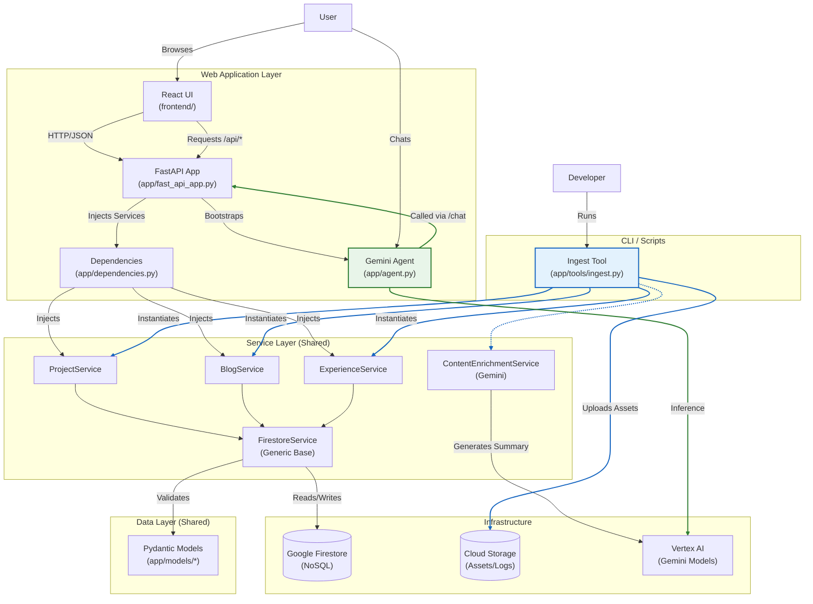
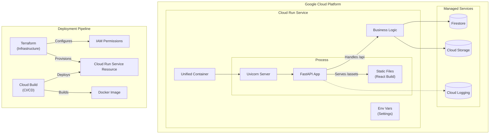

# Design and Walkthrough

## Table of Contents
- [Design Decisions](#design-decisions)
- [Application Design](#application-design)
    - [Configuration Management](#configuration-management)
- [Presentation Layer (React + FastAPI)](#presentation-layer-react--fastapi)
    - [CORS Strategy](#cors-strategy)
    - [Rate Limiting](#rate-limiting)
    - [Search Engine Optimization (SEO)](#search-engine-optimization-seo)
- [Service Layer](#service-layer)
- [Firestore Data Model](#firestore-data-model)
- [Solution Architecture](#solution-architecture)
    - [Component Architecture](#component-architecture)
    - [Runtime & Deployment Architecture](#runtime--deployment-architecture)
- [Frontend Implementation](#frontend-implementation)
- [Resource Ingestion Architecture](#resource-ingestion-architecture)
- [Future Enhancements](#future-enhancements-rag--vector-search)

This document serves as the technical reference for the **Dazbo Portfolio** application. It outlines the key architectural decisions, the solution design, and the operational workflows for managing content. It is intended for developers and maintainers seeking to understand the system's inner workings, from the React-FastAPI runtime to the data ingestion pipelines.

## Design decisions:

| Decision | Rationale |
|----------|-----------|
| **Use Gemini for LLM** | Native multimodal capabilities and massive 1M+ token context window. |
| **Use ADK for agent framework** | Provides a production-grade foundation for agent orchestration. Provides the ability to orchestrate across multiple agents, manage context and artifacts, provides agentic evaluation tools, and provides convenient developer tools for interacting with agents. |
| **Use FastAPI for backend** | Chosen for its high-performance async capabilities, automatic OpenAPI documentation, and native Pydantic integration, ensuring strict type validation across the API surface. |
| **Use React for frontend** | The industry standard for dynamic UIs. Its declarative component model efficiently handles complex states (like real-time chat and dynamic content filters) and benefits from a massive ecosystem. |
| **Use Vite for frontend build** | Offers instant Hot Module Replacement and optimized production builds using Javascript ES modules, significantly outperforming legacy Webpack-based tools in developer experience and build speed. Efficient delivery to the client. |
| **Use Terraform for infrastructure** | Enables declarative Infrastructure as Code (IaC), allowing us to version, audit, and reproduce the entire GCP environment (Cloud Run, Firestore, IAM) consistently across environments. |
| **Use Google Cloud Build for CI/CD** | A fully managed, serverless CI/CD platform that integrates natively with GCP security. It executes builds in ephemeral, secure environments close to our artifact registry. Integrates seamlessly with GitHub, so that changes pushed to GitHub result in new builds and deployments. |
| **Unified Container Image** | Packaging the frontend, backend, and agent into a single container ensures atomic deployments, and greatly simplifies the overall solution and deployment process. |
| **Unified Origin Architecture** | Serving React static assets directly from the FastAPI backend (acting as the origin) completely eliminates CORS complexity in production and simplifies cookie handling. |
| **Use Firestore for Database** | A serverless, NoSQL document database chosen for its flexibility with semi-structured data (blogs, projects) and seamless integration with the ADK for chat memory/history. |
| **Use Cloud Storage (GCS)** | Scalable object storage used for hosting static assets (images, badges) and archiving logs. It provides a secure, low-latency origin for serving media content globally. |
| **`/api` Prefix** | Establishes a strict routing namespace: `/api` for backend services; all other routes fallback to the SPA (`index.html`). |
| **Deploy to Cloud Run** | A fully managed serverless platform that scales to zero (cost-effective) and handles autoscaling automatically. It abstracts infrastructure management while running standard OCI containers. It also supports custom domains without the need for a Load Balancer. |
| **Use `uv` for Package Management** | Replaces `pip`/`poetry` with a single, ultra-fast (Rust-based) tool for dependency resolution and environment management, ensuring deterministic builds. |
| **Use `InMemorySessionService`** | Sessions are designed to be ephemeral (per browser tab). An in-memory store offers the lowest possible latency and simplest implementation without needing external persistence like Redis. |
| **Use In-Memory Rate Limiting** | Implemented via `slowapi` to provide essential DoS protection and cost control for the LLM. At our current scale, this avoids the operational overhead of a dedicated Redis cluster. |
| **Hybrid Ingestion for Medium** | Combines RSS feed and Zip Archive (history) to overcome the issue that Medium's RSS feed only returns the last 10 blogs. |
| **AI-Powered Summary Creation** | Uses Gemini to generate concise technical summaries from ingested blogs. |
| **AI-Powered Markdown Creation** | Uses Gemini to generate structured Markdown from raw blog HTML. |
| **Use Cloud Run Domain Mapping** | Maps custom domain directly to the Cloud Run service, removing the need for a Load Balancer. |
| **Use React 19 Native Metadata** | Leverages built-in hoisting for `<title>` and `<meta>` tags, eliminating the need for external libraries like `react-helmet`. |

## Application Design

The application follows a clean, layered architecture to ensure separation of concerns and testability.

### Configuration Management

The application uses `pydantic-settings` to manage configuration in a centralized and type-safe manner.

*   **Settings Model**: Defined in `app/config.py`, the `Settings` class declares all configurable parameters (e.g., Project ID, Model Name, API Keys).
*   **Loading Strategy**:
    1.  **Environment Variables**: In production environments (like Cloud Run), settings are injected as environment variables. This is the primary method for configuration.
    2.  **`.env` File**: For local development, settings are loaded from a `.env` file in the project root. This file is excluded from version control.
*   **Usage**: The `settings` object is imported and used throughout the application (e.g., in `app/agent.py`), ensuring that hardcoded values are avoided.

## Presentation Layer (React + FastAPI)

The application employs a **Unified Origin Architecture**. In production, the FastAPI backend serves both the REST API and the compiled React frontend assets.

*   **Frontend (React/Vite)**:
    *   **Framework**: React 19+ with TypeScript, built using Vite.
    *   **UI Library**: React Bootstrap styled with Material Design principles (custom CSS variables).
    *   **Navigation**: `react-router-dom` handles client-side routing (Home, Sections).
    *   **Components**:
        *   `MainLayout`: Wrapper providing Navbar and Footer.
        *   `ShowcaseCarousel`: Reusable, responsive carousel for displaying content cards (Blogs, Projects).
        *   `ChatWidget`: Persistent floating button that toggles the agent interface.
    *   **API Calls**: All frontend data fetching is directed to the `/api` prefix (e.g., `/api/blogs`).

*   **Backend (FastAPI)**:
    *   **Entry Point**: `app/fast_api_app.py` initializes the application, configures middleware (CORS, Telemetry), and defines the lifespan context.
    *   **API Prefixing**: All routes are explicitly prefixed with `/api`.
    *   **Static Serving**: Mounts the `frontend/dist` directory to serve static assets (`/assets/*`).
    *   **SPA Support**: Implements a catch-all route that serves `index.html` for any non-API, non-asset path, enabling React Router's client-side navigation.
    *   **Dependency Injection**: `app/dependencies.py` provides dependency injection providers to supply Services to Route Handlers.
    *   **Routes**: API endpoints expose the functionality (e.g., `/projects`, `/blogs`, `/experience`) and Agent interaction.

## CORS Strategy

*   **Production**: Since the frontend and API share the same origin (protocol, host, and port), the browser's Same-Origin Policy is satisfied without any explicit CORS configuration.
*   **Local Development**: To maintain a rapid developer loop, the React development server (`:5173`) and FastAPI backend (`:8000`) run as separate processes. Vite is configured to **proxy** requests from `/api` to the backend, mirroring the production environment's single-origin behavior. This avoids the need to enable permissive CORS headers on the backend.

## Rate Limiting

The application implements a multi-tier rate limiting strategy using `slowapi` (a Python port of `Flask-Limiter`) to protect against abuse and manage operational costs.

### Backend Strategy

*   **Global Limit**: A baseline limit of 60 requests per minute is applied to all endpoints under the `/api` prefix.
*   **Strict Agent Limit**: The chat endpoint (`/api/chat/stream`) is restricted to 5 requests per minute per client IP to control LLM token usage and costs.
*   **Exemptions**: Health checks (`/api/health`) and static assets served by the backend are exempt from rate limiting.
*   **Storage**: Limits are tracked in-memory within the FastAPI process. Note that in a multi-instance Cloud Run deployment, limits are enforced per-instance.

### Frontend Integration

*   **Chat Feedback**: The `ChatWidget` component explicitly checks for HTTP 429 status codes. If a user exceeds the limit, it displays a friendly message: *"You're sending messages too fast. Please wait a moment before trying again."*
*   **Global Handling**: A central Axios interceptor (`frontend/src/services/api.ts`) monitors all API responses. Any 429 error triggers a console warning to notify developers and users of rate limit exhaustion.

## Search Engine Optimization (SEO)

The application implements a comprehensive SEO strategy to ensure visibility and professional presentation on social media and search engines.

### Document Metadata (React 19)

We leverage **React 19's native support for document metadata**. This allows components to define `<title>`, `<meta>`, and `<link>` tags directly in their render output. React automatically hoists these tags to the `<head>` of the document and manages updates during client-side navigation.

*   **`SEO` Component**: A reusable component (`frontend/src/components/SEO.tsx`) that centralizes the management of:
    *   **Standard Tags**: Title, Description.
    *   **Open Graph (OG)**: `og:title`, `og:description`, `og:image`, `og:url`, `og:type`.
    *   **Twitter Cards**: `twitter:card`, `twitter:title`, `twitter:description`, `twitter:image`.
    *   **Structured Data**: Injects JSON-LD (Schema.org) scripts for rich search results (e.g., `Person` schema on the Home page).

### Static XML Sitemap

To facilitate discovery of the application, the FastAPI backend provides a sitemap at `/sitemap.xml`.

*   **Implementation**: The endpoint (`app/fast_api_app.py`) constructs a simple XML response pointing to the root URL.
*   **Static Pages**: Includes the home page.

### Robots.txt

A static `robots.txt` file in `frontend/public/` directs crawlers to the sitemap endpoint.

## Service Layer

*   **Generic Data Access**: `app/services/firestore_base.py` defines a generic `FirestoreService[T]` class. It handles common CRUD operations (create, get, list, update, delete) for any Pydantic model.
*   **Domain Services**: Specialized services (`ProjectService`, `BlogService`, `ExperienceService`) inherit from the generic base or use it to implement domain-specific logic.
*   **Session Management**: Uses `InMemorySessionService` from the Google ADK. Sessions are ephemeral and tied to the current application process, which is sufficient for the portfolio's conversational needs.

### Data/Model Layer

*   **Pydantic Models**: Located in `app/models/`, these define the schema for data entities (`Project`, `Blog`, `Experience`) and ensure type safety and validation between the API and Firestore.

## Firestore Data Model

The application uses **Google Firestore** in Native mode. Data is organized into top-level collections corresponding to the domain entities.

### Collections

*   **`projects`**: Stores portfolio projects (e.g., GitHub repos, manual entries).
*   **`applications`**: Stores curated applications (e.g., standalone websites, live demos) ingested via YAML.
*   **`blogs`**: Stores blog posts (e.g., Medium articles, Dev.to posts).
*   **`experience`**: Stores work experience entries.

### Document IDs

To ensure readable and deterministic URLs/pointers, the system uses **Slug-based IDs** for documents in the `projects` and `blogs` collections.

*   **Generation**: IDs are generated by "slugifying" the entity's title (lowercase, alphanumeric, hyphens).
    *   Example: Title "My Awesome Project" -> ID `my-awesome-project`
*   **Benefits**:
    *   **Readability**: Easier to identify documents in the Cloud Console.
    *   **Determinism**: Re-ingesting the same resource (with the same title) maps to the same document, preventing duplicates.

### Blog Model Fields

The `blogs` collection uses the following schema:

| Field | Type | Description | Source |
| :--- | :--- | :--- | :--- |
| `title` | String | The title of the blog post. | RSS / Medium Export (HTML Title) |
| `date` | String | Publication date in ISO 8601 format (YYYY-MM-DD). | RSS / Medium Export (`time` tag) |
| `url` | String | Canonical URL to the original post. | RSS / Medium Export (Footer link) |
| `platform` | String | The publishing platform (e.g., "Medium", "Dev.to"). | Connector specific |
| `summary` | String | A short description or subtitle. Used for list views. | RSS Description / Medium Subtitle. Fallback to `ai_summary`. |
| `ai_summary` | String | A comprehensive technical summary generated by Gemini. | **Generated** by `ContentEnrichmentService` from full text. |
| `markdown_content` | String | The full blog content converted to Markdown. Includes frontmatter. | **Converted** from HTML export using `markdownify`. |
| `tags` | Array<String> | List of technical tags. | Medium Tags (`ul.p-tags`) or **Generated** by `ContentEnrichmentService`. |
| `is_private` | Boolean | Flag for paywalled/member-only content. | Heuristic check ("Member-only story") in content. |
| `is_manual` | Boolean | True if added via YAML, False if ingested via API/Zip. | Ingestion logic |
| `source_platform` | String | Specific connector source (e.g., `medium_rss`, `medium_archive`). | Ingestion logic |

## Solution Architecture

### Component Architecture

The following diagram illustrates the relationship between the application's runtime components, the ingestion scripts, and the shared code modules.



### Runtime & Deployment Architecture



### Module & Service Relationships

The architecture is designed to maximize code reuse between the runtime API and the offline ingestion tools.

1.  **Shared Service Layer**: Both the FastAPI application (`app/fast_api_app.py`) and the Ingestion CLI (`app/tools/ingest.py`) rely on the same Service Layer (`app/services/`). This ensures that business logic, such as data validation or Firestore interactions, remains consistent regardless of whether data is being accessed by a user or written by a script.
2.  **Dependency Injection**: The FastAPI app uses `app/dependencies.py` to inject these services into route handlers. This decouples the routes from the concrete service implementation, facilitating testing and loose coupling.
3.  **Generic Data Access**: The `FirestoreService` (`app/services/firestore_base.py`) provides a generic implementation of CRUD operations using Python 3.12+ type parameters. Domain-specific services (`ProjectService`, etc.) inherit from this base, reducing boilerplate code.
4.  **Agent Integration**: The Gemini Agent (`app/agent.py`) is integrated directly into the FastAPI application. It shares the same runtime environment and can potentially access the same services (via tools) to answer user queries about the portfolio content.

## Frontend Implementation

The frontend is a single-page application (SPA) built with React and Vite. It is designed to be responsive, performant, and visually consistent with the Material Design system.

### Key Components

*   **`MainLayout`**: The top-level wrapper for all pages. It includes the `AppNavbar` (top), `Footer` (bottom), and the `ChatWidget`.
*   **`ShowcaseCarousel`**: A reusable component for displaying collections of items (blogs, projects, etc.).
    *   **Responsiveness**: On mobile, it displays 1 item per slide. On desktop, it displays a grid of 3 items per slide.
    *   **Navigation**: Includes custom-styled "Previous" and "Next" controls and indicators.
*   **`ChatWidget`**: A floating action button (FAB) that expands into a chat interface. It currently serves as a shell for future agent integration.

### Development Workflow

There are two primary ways to run the application locally:

#### 1. Process Mode (Rapid Frontend/Backend Iteration)

Ideal for daily development with hot-reloading.

1.  **Start the Backend**: `make local-backend` (port 8000).
2.  **Start the Frontend**: `make react-ui` (port 5173).
3.  **Access**: `http://localhost:5173`. Requests to `/api/*` are proxied to port 8000.

#### 2. Container Mode (Production Parity)
Ideal for verifying the final build and deployment configuration.
1.  **Build**: `make docker-build`.
2.  **Run**: `make docker-run`.
3.  **Access**: `http://localhost:8080`. Port 8080 serves both the UI and the API.

## Use Cases

*   **Portfolio Browsing**: Users can retrieve lists of projects, blog posts, and work experience.
*   **Agent Interaction**: Users can chat with the Gemini-powered agent to ask questions about the portfolio owner's skills and background.

## Resource Ingestion Architecture

The portfolio populates its content (Projects and Blogs) through a hybrid ingestion system, designed to be run "out-of-band" via a CLI tool.

### The Ingestion CLI (`app/tools/ingest.py`)

This tool allows the developer to trigger synchronization from external sources or ingest manually defined resources from a YAML file.

**Usage:**
```bash
uv run python -m app.tools.ingest \
  --github-user <user-name> \
  --medium-user <user-name> \
  --medium-zip <path-to-posts.zip> \
  --devto-user <user-name> \
  --yaml-file manual_resources.yaml
```

### Connectors

The system uses modular "Connectors" to fetch data:
*   **GitHub Connector:** Uses the GitHub API to fetch public repositories. Maps `html_url` to `repo_url`, `topics` to `tags`, and `description` to `description`. **Note:** Repositories marked as forks are automatically filtered out to ensure only original work is showcased.
*   **Medium Connector (RSS):** Parses the user's Medium RSS feed for the latest 10 posts. Provides the source of truth for current metadata (date, title).
*   **Medium Archive Connector (Zip):** Parses a Medium export archive (`posts.zip`). Retrieves the full history of posts and provides the source of truth for post content.
*   **Dev.to Connector:** Uses the Dev.to API to fetch published articles. Maps articles to `Blog` entries.
*   **Manual YAML:** Parses a local YAML file for "Metadata Only" entries (e.g., private projects, external links, paywalled articles).

### Content Processing & AI Enrichment

For enriched content (specifically from Medium archives), the ingestion pipeline performs the following steps:

1.  **Draft Filtering:** Files with "draft" in the name or title are automatically skipped to keep the portfolio clean.
2.  **HTML to Markdown Conversion:** Raw HTML from the export is converted to structured Markdown using `markdownify`.
    -   **Title:** Forced to H1 (`#`).
    -   **Headings:** Mapped to H2 (`##`).
    -   **Subheadings:** Mapped to H3 (`###`).
    -   **Frontmatter:** A YAML frontmatter block is prepended with `title`, `subtitle`, `date`, `url`, and `tags`.
3.  **Paywall Detection:** A heuristic scanner checks for "Member-only story" markers in the content to flag paywalled posts (`is_private: true`).
4.  **AI Enrichment (ContentEnrichmentService):** The `ContentEnrichmentService` sends the extracted text to Gemini to:
    -   Generate a comprehensive technical **summary** (up to 300 words).
    -   Propose 5 relevant **technical tags**.
    -   Return the result as structured JSON.
    -   If the original HTML tags are missing, these AI-generated tags are used.

### Data Persistence & Idempotency

*   **Destination:** All data is stored in **Google Firestore**.
*   **Sequential Processing:** The ingestion tool processes the archive file-by-file and persists to Firestore immediately. This allows the long-running process to be interrupted and resumed without data loss.
*   **"Skip Existing" Optimization:** Before processing a file (and incurring the cost of AI enrichment), the system checks if the URL already exists in Firestore. If it does, the file is skipped (`skipped_existing`).
*   **Hybrid Merge Strategy:** When a post exists in both the RSS feed and the Zip archive:
    -   **RSS** provides the latest `date` and `title`.
    -   **Archive** provides the `markdown_content`, `ai_summary`, `tags`, and `is_private` status.

### Ingestion Experience (CLI)

The CLI tool (`app/tools/ingest.py`) provides rich visual feedback:
*   **Progress Bar:** Shows the percentage complete, current file, and estimated time remaining.
*   **Phase Reporting:** Indicates the current sub-task for each file (e.g., "Reading", "Parsing content", "Processing content").
*   **Skip Notifications:** Explicitly logs why a file was ignored (e.g., "Skipping (draft)", "Skipping (not a blog)", "Skipping (existing)").
*   **Summary Stats:** At the end, a detailed report shows counts for processed items, skipped drafts, skipped comments, and RSS-only updates.

#### Console UX with Rich
The application uses the `rich` library to enhance the CLI experience.
-   **Progress Context:** Long-running operations (like zip parsing) are wrapped in a `Progress` context manager.
-   **Custom Columns:** We use `SpinnerColumn`, `BarColumn`, and `TimeRemainingColumn` to provide real-time feedback.
-   **Thread-Safe Logging:** The `console.log` method is used within the progress loop to print messages (like skip notifications) without breaking the progress bar layout.
-   **Formatted Output:** `console.print` supports BBCode-like syntax (e.g., `[bold blue]...[/]`) for readable status updates.

### Static Assets (Images)

*   **Storage:** Images (project screenshots, thumbnails) are stored in a public **Google Cloud Storage (GCS)** bucket (e.g., `<project-id>-assets`).
*   **Ingestion:** Currently, images must be uploaded manually to the GCS bucket (e.g., via `gsutil` or Cloud Console).
*   **Linking**:
    *   **New Manual Entries:** Add the public URL to the `image_url` field in your `manual_resources.yaml` file.
    *   **Existing Entries (e.g., from GitHub/Medium):**
        1.  Upload the image to the GCS bucket.
        2.  Copy the public URL (e.g., `https://storage.googleapis.com/<bucket>/<image.png>`).
        3.  Go to the **Google Cloud Console > Firestore**.
        4.  Find the document for the project or blog post.
        5.  Manually add or update the `image_url` field with the copied URL.
*   **Future:** Automated image scraping and uploading may be added in future phases.

### Data Management

*   **Deletions:** The ingestion tool currently supports **create** and **update** operations. It does *not* delete entries that have been removed from the source.
    *   **To Delete:** Use the **Google Cloud Console (Firestore)** to manually delete obsolete documents. This is a safety design choice to prevent accidental bulk deletion.

### Manual Resources YAML Schema

To ingest resources that are not on GitHub, Medium, or Dev.to (e.g., standalone websites, private projects, or specific external articles), use a YAML file with the following structure:

**Example `manual_resources.yaml`:**

```yaml
projects:
  - title: "Some External Project"
    description: "A project not on GitHub."
    repo_url: "https://some-link.com"
    tags: ["python", "cli"]
    featured: true
    metadata_only: true 

applications:
  - title: "Advent of Code Walkthroughs"
    description: "A comprehensive site featuring Python walkthroughs and learning resources for Advent of Code challenges."
    demo_url: "https://aoc.just2good.co.uk/"
    image_url: "https://storage.googleapis.com/<project-id>-assets/aoc-walkthroughs.png"
    tags: ["python", "algorithms", "education"]

blogs:
  - title: "Understanding Python Decorators"
    summary: "A deep dive into how decorators work under the hood."
    date: "2025-12-01"
    platform: "External"
    url: "https://realpython.com/some-guest-post"
    metadata_only: true
```

**Fields:**

*   **Projects:** `title` (required), `description`, `repo_url`, `demo_url`, `image_url`, `tags` (list), `featured` (bool), `metadata_only` (bool).

*   **Applications:** `title` (required), `description` (required), `demo_url` (required), `repo_url` (optional), `image_url`, `tags` (list). These are automatically marked as `featured: true` and `source_platform: "application"`.

*   **Blogs:** `title` (required), `summary`, `date` (ISO 8601), `platform` (e.g., "External", "Substack"), `url` (required), `metadata_only` (bool).

## Future Enhancements: RAG & Vector Search

To improve the chatbot's ability to answer specific questions about the portfolio content, we plan to implement Retrieval-Augmented Generation (RAG) using Vector Search.

### Architecture

*   **Embeddings Model:** Google Vertex AI Embeddings (e.g., `text-embedding-004`).
*   **Vector Store:** Google Firestore Vector Search (using `KNN_VECTOR` fields and vector indexes).
*   **Ingestion Pipeline Update:**
    1.  When a project or blog is ingested/updated, generate a text embedding for its description/summary.
    2.  Store the embedding vector in a new field (e.g., `embedding`) in the Firestore document.

*   **Agent Tooling:**
    1.  Create a new tool `search_portfolio_vector` (or update existing).
    2.  The tool will generate an embedding for the user's query.
    3.  Perform a vector similarity search (cosine distance) in Firestore to find the most relevant documents.
    4.  Pass the retrieved context to the Gemini model for answer generation.
